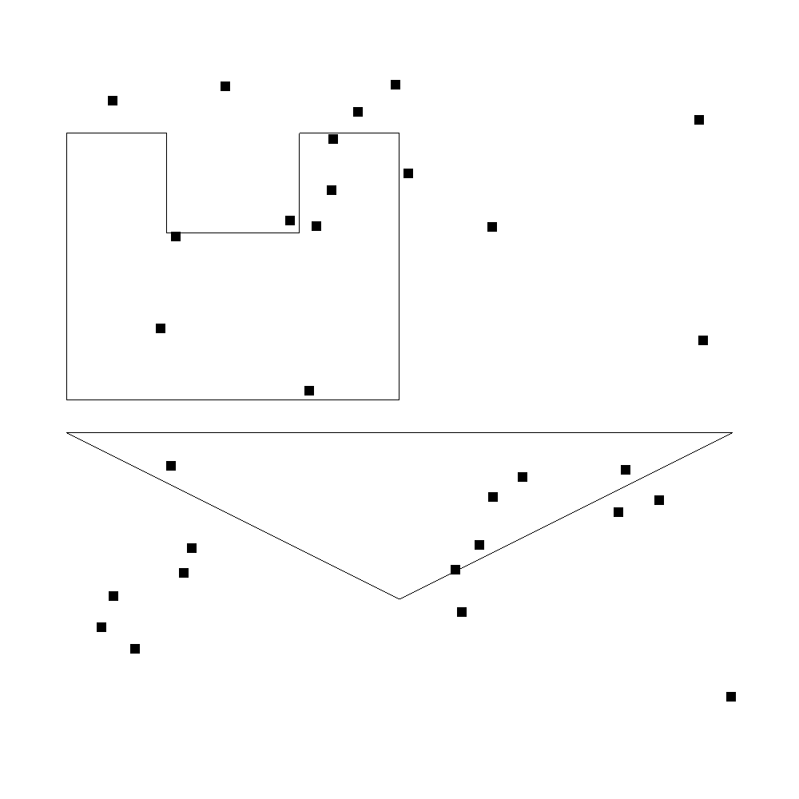
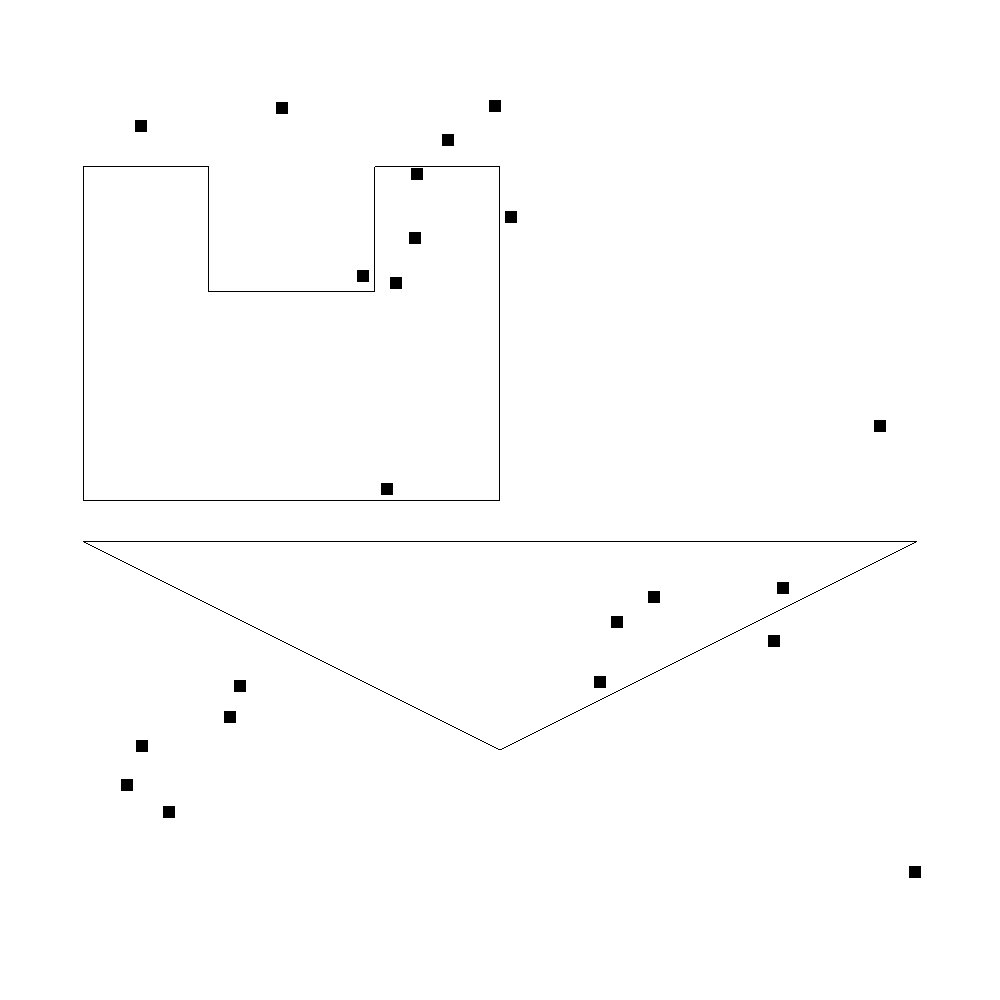
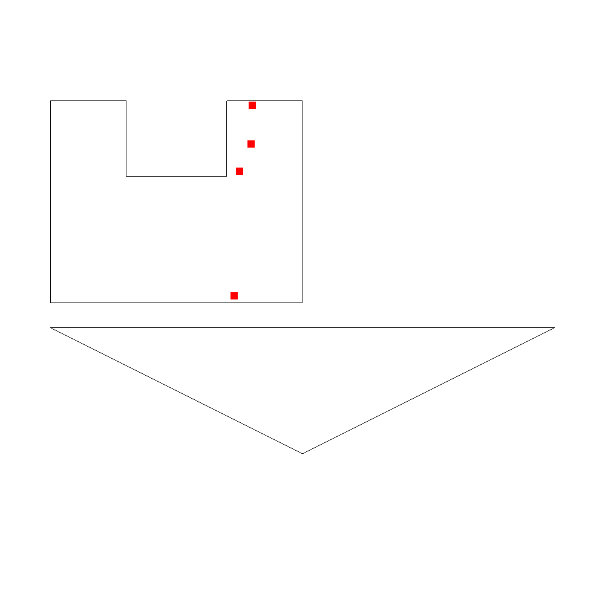
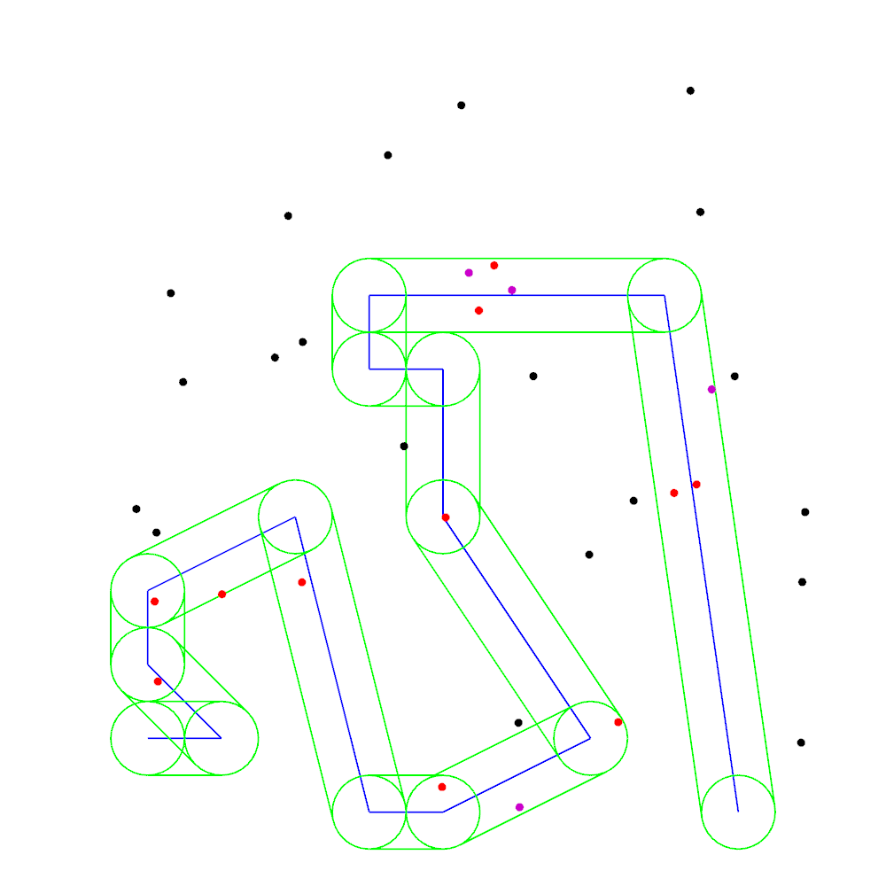

# spatial-database-coursework
The database are full-in-gpu-memory key-value database that allowed to be saved on hard disk with integrity check at load.
The database is allowed to create tables with spatial-temporal keys and values of different types. Every key is unique in a table.
The key consists of two parts:
1. Spatial part is a polygon or point or polyline in 2D (each point are in \[-180;180\]X\[-90;90\]).
2. Temporal part is interval of *valid time* or *transaction time* or *bitemporal time* (both *valid time* and *transaction time*)
Values is a string where each element can be one of the following types: *string*, *integer*, *float*, *time*.
The Database is not supported parallel queries. 
Each query to the database is simultaneously applied to all rows (1 Cuda thread per row) and is accelerated by [HLBVH2](https://dl.acm.org/citation.cfm?id=2018333). It is a spatial binary tree which can be built on GPU in linear time. It used z-curve for mapping 4D space (2D spatial + 2D temporal spaces) to the 1D 96bit key. 

The database supports the following types of operation:

1. Find k-nearest neighbours for points.

> **Input**: two tables with points as spatial part of keys
>
> **Output**: new table with rows of the first table which are modified by addition column. Each element in this column consists of the rows from the second table that are k-nearest neighbours for the key in the row.
>
>Algorithm used HLBVH2 and based on computing [min/minimax dist](http://postgis.refractions.net/support/nearestneighbor.pdf)

2. Find points that are laid in polygon:

> **Input**: two tables, the first with polygon as spatial part of keys and the second with point.
>
> **Output**: new table with rows of the first table which are modified by addition column. Each element in this column consists of the rows from the second table such that the point from the key in the row from the second table are laid in polygon from the key in the row from the first table.

3. Find points that are located on distance not more than *R* from the polyline.

> **Input**: two tables, the first with polyline as spatial part of keys and the second with point.
>
> **Output**: new table with rows of the first table which are modified by addition column. Each element in this column consists of the rows from the second table such that the point from the key in the row from the second table are located on distance not more than *R* from the polyline from the key in the row from the first table.

4. Insert many rows in a table as one query.
5. Delete, update, select rows from table by user-specified predicate.

For more information please read [texv2.pdf](https://github.com/sargarass/spatial-database-coursework/blob/master/texv2.pdf) (in russian)

# Libraries that were used:
1. cmake 3.0
2. CUDA (nvidia-cuda-toolkit)
3. glew
4. glfw3
5. thrust
6. cub
7. moderngpu
8. openssl

# How to build (tested in linux gentoo)
In the folder with project type in console:
- cmake CMakeLists.txt
- make

# How to run
You need nvidia videocard which are support compute capability 2.0.

In the *bin* folder run console application *DataBase*

# Cache tuning
In the file *database.cpp* you can change cache size in gpu and ram. 

These caches are used to fast allocation temp memories for operation (stack allocators).
```C++
gpudb::GpuStackAllocator::getInstance().resize(1056ULL * 1024ULL * 1024ULL);
StackAllocator::getInstance().resize(1024ULL * 1024ULL * 1024ULL);
```

# Tests
## "TELE-3" (Point inside polygon)
Let "Tele3" be telecommunications company that wanted to know which subscribers were in offices at the specified interval of time. We supposed that "Tele3" has table "Абоненты ТЕЛЕ-3". Each key in this table consists of GPS position (point) and the time when subscriber was in that position. Each value consists of list with first name ("Имя") and second name ("Фамилия") of subscriber. And supposed that "Tele3" also has table "Офисы ТЕЛЕ-3". Each key in this table consists of office boundary (polygon) and when this office was added to the database.

Code that create this databases:
```
DataBase &db = DataBase::getInstance();
TableDescription abonents, offices;
abonents.setName("Абоненты ТЕЛЕ-3");
abonents.setSpatialKey("Позиция", SpatialType::POINT);
abonents.setTemporalKey("Время", TemporalType::VALID_TIME);
AttributeDescription name, secondName;
name.name = "Имя";
name.type = Type::STRING;
secondName.name = "Фамилия";
secondName.type = Type::STRING;
abonents.addColumn(name);
abonents.addColumn(secondName);
db.createTable(abonents);

offices.setName("Офисы ТЕЛЕ-3");
offices.setSpatialKey("Граница офиса", SpatialType::POLYGON);
offices.setTemporalKey("Время внесения в таблицу", TemporalType::TRANSACTION_TIME);
AttributeDescription street, officeName;
street.name = "Адрес"; street.type = Type::STRING;
officeName.name = "Название офиса"; officeName.type = Type::STRING;
offices.addColumn(street); offices.addColumn(officeName);
db.createTable(offices);
/*... fill tables ...*/
db.showTable("Абоненты ТЕЛЕ-3");
db.showTable("Офисы ТЕЛЕ-3");
```
For keys generation in table "Абоненты ТЕЛЕ-3" we used random floats in \[-1;1\] and random time intervals from 2012 to 2016 years.
The data from this table are shown below:
```
Table "Абоненты ТЕЛЕ-3" [{
 0:  Key {[Позиция : Point : {0,680375, -0,211234}], [Время : Valid Time {2015/12/01 17:20:05:148160 - 2015/12/01 17:20:53:54464}]} 
     Value {[Имя : STRING : "Ануфрий"] , [Фамилия : STRING : "Гришин"] }
 1:  Key {[Позиция : Point : {-0,329554, 0,536459}], [Время : Valid Time {2013/05/22 11:51:55:869440 - 2013/05/22 11:52:29:107712}]}
     Value {[Имя : STRING : "Лазарь"] , [Фамилия : STRING : "Нестеров"] }
 2:  Key {[Позиция : Point : {-0,270431, 0,026802}], [Время : Valid Time {2016/10/05 17:22:08:361984 - 2016/10/05 17:23:03:333632}]}
     Value {[Имя : STRING : "Елисей"] , [Фамилия : STRING : "Попов"] }
 3:  Key {[Позиция : Point : {-0,716795, 0,213938}], [Время : Valid Time {2012/01/30 18:44:50:872576 - 2012/01/30 18:45:05:445888}]}
     Value {[Имя : STRING : "Томас"] , [Фамилия : STRING : "Симонов"] }
 4:  Key {[Позиция : Point : {-0,686642, -0,198111}], [Время : Valid Time {2012/08/25 03:03:05:437696 - 2012/08/25 03:03:11:966208}]}
     Value {[Имя : STRING : "Абрам"] , [Фамилия : STRING : "Давыдов"] }
 5:  Key {[Позиция : Point : {0,025865, 0,678224}], [Время : Valid Time {2015/01/24 07:01:52:966656 - 2015/01/24 07:02:10:728448}]}
     Value {[Имя : STRING : "Елизар"] , [Фамилия : STRING : "Лукин"] }
 6:  Key {[Позиция : Point : {-0,012834, 0,945550}], [Время : Valid Time {2013/06/18 10:16:33:466624 - 2013/06/18 10:17:19:748096}]}
     Value {[Имя : STRING : "Карл"] , [Фамилия : STRING : "Самсонов"] }
 7:  Key {[Позиция : Point : {-0,199543, 0,783059}], [Время : Valid Time {2013/06/01 14:47:05:938176 - 2013/06/01 14:47:27:85568}]} 
     Value {[Имя : STRING : "Варлаам"] , [Фамилия : STRING : "Фокин"] }
 8:  Key {[Позиция : Point : {-0,860489, 0,898654}], [Время : Valid Time {2014/08/18 23:50:38:819584 - 2014/08/18 23:50:43:982848}]} 
     Value {[Имя : STRING : "Сильвестр"] , [Фамилия : STRING : "Одинцов"] }
 9:  Key {[Позиция : Point : {0,780465, -0,302214}], [Время : Valid Time {2012/04/27 05:47:02:666240 - 2012/04/27 05:47:03:867648}]} 
     Value {[Имя : STRING : "Лукьян"] , [Фамилия : STRING : "Белоусов"] }
10:  Key {[Позиция : Point : {-0,523440, 0,941268}], [Время : Valid Time {2016/07/06 08:01:10:582272 - 2016/07/06 08:02:01:637376}]} 
     Value {[Имя : STRING : "Рауф"] , [Фамилия : STRING : "Мамонтов"] }
11:  Key {[Позиция : Point : {-0,249586, 0,520498}], [Время : Valid Time {2014/07/25 09:39:02:328576 - 2014/07/25 09:39:42:392064}]} 
     Value {[Имя : STRING : "Камиль"] , [Фамилия : STRING : "Артемьев"] }
12:  Key {[Позиция : Point : {-0,124725, 0,863670}], [Время : Valid Time {2016/08/27 14:08:52:464896 - 2016/08/27 14:09:35:721984}]} 
     Value {[Имя : STRING : "Протас"] , [Фамилия : STRING : "Романов"] }
13:  Key {[Позиция : Point : {0,279958, -0,291903}], [Время : Valid Time {2015/06/10 17:20:46:465536 - 2015/06/10 17:20:56:423936}]}
     Value {[Имя : STRING : "Максимилиан"] , [Фамилия : STRING : "Трофимов"] }
14:  Key {[Позиция : Point : {0,658402, -0,339326}], [Время : Valid Time {2013/02/22 07:47:46:910208 - 2013/02/22 07:48:40:512512}]}
     Value {[Имя : STRING : "Никон"] , [Фамилия : STRING : "Панфилов"] }
15:  Key {[Позиция : Point : {0,912937, 0,177280}], [Время : Valid Time {2015/04/15 21:28:03:91200 - 2015/04/15 21:28:54:611712}]} 
     Value {[Имя : STRING : "Малик"] , [Фамилия : STRING : "Фомин"] }
16:  Key {[Позиция : Point : {-0,203127, 0,629534}], [Время : Valid Time {2015/06/04 01:36:50:26240 - 2015/06/04 01:37:44:684544}]} 
     Value {[Имя : STRING : "Кузьма"] , [Фамилия : STRING : "Гущин"] }
17:  Key {[Позиция : Point : {0,900505, 0,840257}], [Время : Valid Time {2012/09/26 18:35:46:777088 - 2012/09/26 18:36:39:640832}]} 
     Value {[Имя : STRING : "Евстрат"] , [Фамилия : STRING : "Копылов"] }
18:  Key {[Позиция : Point : {0,239193, -0,437881}], [Время : Valid Time {2015/12/07 00:37:11:977984 - 2015/12/07 00:37:30:425344}]} 
     Value {[Имя : STRING : "Май"] , [Фамилия : STRING : "Данилов"] }
19:  Key {[Позиция : Point : {-0,624934, -0,447531}], [Время : Valid Time {2014/10/13 14:56:44:817920 - 2014/10/13 14:57:09:807872}]} 
     Value {[Имя : STRING : "Сухраб"] , [Фамилия : STRING : "Федотов"] }
20:  Key {[Позиция : Point : {-0,793658, -0,747849}], [Время : Valid Time {2014/06/24 04:13:53:154304 - 2014/06/24 04:14:38:782720}]} 
     Value {[Имя : STRING : "Авксентий"] , [Фамилия : STRING : "Харитонов"] }
21:  Key {[Позиция : Point : {0,368890, -0,233623}], [Время : Valid Time {2015/10/01 19:57:13:148928 - 2015/10/01 19:57:35:268608}]} 
     Value {[Имя : STRING : "Помпей"] , [Фамилия : STRING : "Денисов"] }
22:  Key {[Позиция : Point : {0,168977, -0,511174}], [Время : Valid Time {2012/10/05 09:59:15:337216 - 2012/10/05 09:59:59:266048}]} 
     Value {[Имя : STRING : "Урман"] , [Фамилия : STRING : "Сергеев"] }
23:  Key {[Позиция : Point : {-0,671796, 0,490143}], [Время : Valid Time {2012/05/16 03:58:57:708032 - 2012/05/16 03:59:54:714112}]} 
     Value {[Имя : STRING : "Цезарь"] , [Фамилия : STRING : "Логинов"] }
24:  Key {[Позиция : Point : {-0,647579, -0,519875}], [Время : Valid Time {2015/12/28 13:50:56:322304 - 2015/12/28 13:51:40:281600}]} 
     Value {[Имя : STRING : "Дорофей"] , [Фамилия : STRING : "Шилов"] }
25:  Key {[Позиция : Point : {0,278917, 0,519470}], [Время : Valid Time {2012/06/19 18:55:55:64064 - 2012/06/19 18:56:03:158272}]} 
     Value {[Имя : STRING : "Касьян"] , [Фамилия : STRING : "Бирюков"] }
26:  Key {[Позиция : Point : {-0,860187, -0,590690}], [Время : Valid Time {2014/04/23 00:21:53:702144 - 2014/04/23 00:22:42:882816}]} 
     Value {[Имя : STRING : "Илиан"] , [Фамилия : STRING : "Савельев"] }
27:  Key {[Позиция : Point : {-0,896122, -0,684386}], [Время : Valid Time {2016/12/31 23:43:05:177088 - 2016/12/31 23:43:17:436672}]} 
     Value {[Имя : STRING : "Арслан"] , [Фамилия : STRING : "Веселов"] }
28:  Key {[Позиция : Point : {0,995598, -0,891885}], [Время : Valid Time {2016/05/09 11:25:55:191040 - 2016/05/09 11:25:59:530752}]} 
     Value {[Имя : STRING : "Ярополк"] , [Фамилия : STRING : "Фомин"] }
29:  Key {[Позиция : Point : {0,187784, -0,639255}], [Время : Valid Time {2012/10/25 00:59:23:928576 - 2012/10/25 00:59:47:429888}]} 
     Value {[Имя : STRING : "Антон"] , [Фамилия : STRING : "Соловьёв"] }
}]
```
The data from "Офисы ТЕЛЕ-3":
```
Table "Офисы ТЕЛЕ-3" [{
0:  Key {[Граница офиса : Polygon : { {-1,000000, 0,000000} {0,000000, 0,000000} {0,000000, 0,800000} {-0,300000, 0,800000} 
         {-0,300000, 0,500000} {-0,700000, 0,500000} {-0,700000, 0,800000} {-1,000000, 0,800000} }],
         [Transaction Time : {2016/08/09 18:37:28:449763}]} 
    Value {[Адрес : STRING : "Улица "Никанор""], [Название офиса : STRING : "Офис имени "Маслов""] }
1:  Key {[Граница офиса : Polygon : { {1,000000, -0,100000} {0,000000, -0,600000} {-1,000000, -0,100000} }],
         [Transaction Time : {2016/08/09 18:37:28:449863}]} 
    Value {[Адрес : STRING : "Улица "Израиль""], [Название офиса : STRING : "Офис имени "Красильников""] }
}]
```

Visualisation of data from tables:



Let's suppose "Теле3" that wanted to know who was in the first office after 2013 year.
For this purpose we can write filter:
```
FILTER_CU(tester){
    Date validE = row.getKeyValidTimeEnd();
    return (validE.getYear() < 2013);
}
```

Order of operation is impacted on performance so it will be smart to use the simple filter first and then apply algorithm for finding all points in polygon. 

```
std::unique_ptr<TempTable> officesTT = db.selectTable("Офисы ТЕЛЕ-3").unwrap();
std::unique_ptr<TempTable> abonentsTT = db.selectTable("Абоненты ТЕЛЕ-3").unwrap();

std::unique_ptr<TempTable> abonentsTT_filtered = db.filter(abonentsTT, tester()); 
// abonentsTT_filtered - first table after applied filter
// it will be smart to choose only first office from second table, but we will not do it :|
// apply algorithm for finding points in polygons
std::unique_ptr<TempTable> output = db.polygonxpointPointsInPolygon(officesTT, abonentsTT_filtered).unwrap();
db.showTable(output); 
std::vector<Row> output_rows = db.selectRow(output, SELECT_ALL_ROWS()); // Select all rows from "output"-table
db.showTable(output_rows[0].getAttribute(2).unwrap().getSet().unwrap()); // show it in console
```


### Visualisation of data from after applying filter:


### Result
```
TempTable "Абоненты ТЕЛЕ-3" [{
0:  Key {[Позиция : Point : {-0,249586, 0,520498}], [Время : Valid Time {2014/07/25 09:39:02:328576 - 2014/07/25 09:39:42:392064}]} 
    Value {[Имя : STRING : "Камиль"] , [Фамилия : STRING : "Артемьев"] }
1:  Key {[Позиция : Point : {-0,203127, 0,629534}], [Время : Valid Time {2015/06/04 01:36:50:26240 - 2015/06/04 01:37:44:684544}]} 
    Value {[Имя : STRING : "Кузьма"] , [Фамилия : STRING : "Гущин"] }
2:  Key {[Позиция : Point : {-0,199543, 0,783059}], [Время : Valid Time {2013/06/01 14:47:05:938176 - 2013/06/01 14:47:27:85568}]} 
    Value {[Имя : STRING : "Варлаам"] , [Фамилия : STRING : "Фокин"] }
3:  Key {[Позиция : Point : {-0,270431, 0,026802}], [Время : Valid Time {2016/10/05 17:22:08:361984 - 2016/10/05 17:23:03:333632}]} 
    Value {[Имя : STRING : "Елисей"] , [Фамилия : STRING : "Попов"] }
}]
```
Visualisation of result:


## Cafes near road (Points that are located on distance not more than *R* from the polyline)

Supposed we wanted to find all nearby cafes to the road. For simplification let first table named "Дороги" consists of only one row. This row specifies the road. The spatial part of the key is *polyline* and temporal part is *transaction time*. The value is name of the road.
This table is shown below:
```
Table "Дороги" [{
0:  Key {[Дорога : Line : { {0,100000; 0,100000}, {0,200000; 0,100000}, {0,100000; 0,200000}, {0,100000; 0,300000},
                            {0,300000; 0,400000}, {0,400000; 0,000000}, {0,500000; 0,000000}, {0,700000; 0,100000},
                            {0,500000; 0,400000}, {0,500000; 0,600000}, {0,400000; 0,600000}, {0,400000; 0,700000},
                            {0,800000; 0,700000}, {0,900000; 0,000000} }],
         [Transaction Time : {2016/08/18 20:23:15:421013}]} 
    Value {[Название : STRING : "M4"]}
}]
```
Second table is consist of rows that are specified buildings (spatial part of the key is *point* and temporal part is *transaction time*). Each value in table consist of street name ("Название") and type of building ("Тип")
```
Table "Строения" [{
 0:  Key {[Позиция : Point : {0,498761; 0,033992}], [Transaction Time : {2016/08/18 20:25:45:209685}]} 
     Value {[Название : STRING : "Улица "Мартин""], [Тип : STRING : "Стадион"]}
 1:  Key {[Позиция : Point : {0,603745; 0,006660}], [Transaction Time : {2016/08/18 20:25:45:209922}]} 
     Value {[Название : STRING : "Улица "Добрыня""], [Тип : STRING : "Кафе"]}
 2:  Key {[Позиция : Point : {0,548661; 0,679430}], [Transaction Time : {2016/08/18 20:25:45:210012}]} 
     Value {[Название : STRING : "Улица "Нифонт""], [Тип : STRING : "Кинотеатр"]}
 3:  Key {[Позиция : Point : {0,113908; 0,176936}], [Transaction Time : {2016/08/18 20:25:45:210094}]} 
     Value {[Название : STRING : "Улица "Рихард""], [Тип : STRING : "Памятник"]}
 4:  Key {[Позиция : Point : {0,569275; 0,740459}], [Transaction Time : {2016/08/18 20:25:45:210158}]} 
     Value {[Название : STRING : "Улица "Леон""], [Тип : STRING : "Отель"]}
 5:  Key {[Позиция : Point : {0,425463; 0,889715}], [Transaction Time : {2016/08/18 20:25:45:210239}]} 
     Value {[Название : STRING : "Улица "Аникита""], [Тип : STRING : "Отель"]}
 6:  Key {[Позиция : Point : {0,622414; 0,590444}], [Transaction Time : {2016/08/18 20:25:45:210303}]} 
     Value {[Название : STRING : "Улица "Серапион""], [Тип : STRING : "Отель"]}
 7:  Key {[Позиция : Point : {0,812990; 0,432279}], [Transaction Time : {2016/08/18 20:25:45:210365}]} 
     Value {[Название : STRING : "Улица "Иннокентий""], [Тип : STRING : "Отель"]}
 8:  Key {[Позиция : Point : {0,986619; 0,311751}], [Transaction Time : {2016/08/18 20:25:45:210426}]} 
     Value {[Название : STRING : "Улица "Рустам""], [Тип : STRING : "Ресторан"]}
 9:  Key {[Позиция : Point : {0,895191; 0,590364}], [Transaction Time : {2016/08/18 20:25:45:210509}]} 
     Value {[Название : STRING : "Улица "Конрад""], [Тип : STRING : "Ресторан"]}
10:  Key {[Позиция : Point : {0,843541; 0,443852}], [Transaction Time : {2016/08/18 20:25:45:210572}]} 
     Value {[Название : STRING : "Улица "Радомир""], [Тип : STRING : "Шаурма"]}
11:  Key {[Позиция : Point : {0,524824; 0,957449}], [Transaction Time : {2016/08/18 20:25:45:210633}]} 
     Value {[Название : STRING : "Улица "Кирилл""], [Тип : STRING : "Церковь "Ктулху""]}
12:  Key {[Позиция : Point : {0,985158; 0,094099}], [Transaction Time : {2016/08/18 20:25:45:210696}]} 
     Value {[Название : STRING : "Улица "Таврион""], [Тип : STRING : "Памятник"]}
13:  Key {[Позиция : Point : {0,084629; 0,410621}], [Transaction Time : {2016/08/18 20:25:45:210757}]} 
     Value {[Название : STRING : "Улица "Мисаил""], [Тип : STRING : "Кинотеатр"]}
14:  Key {[Позиция : Point : {0,593411; 0,707043}], [Transaction Time : {2016/08/18 20:25:45:210818}]} 
     Value {[Название : STRING : "Улица "Маркелл""], [Тип : STRING : "Кафе"]}
15:  Key {[Позиция : Point : {0,990508; 0,406400}], [Transaction Time : {2016/08/18 20:25:45:210881}]} 
     Value {[Название : STRING : "Улица "Зафар""], [Тип : STRING : "Церковь "Ктулху""]}
16:  Key {[Позиция : Point : {0,835276; 0,977127}], [Transaction Time : {2016/08/18 20:25:45:210942}]} 
     Value {[Название : STRING : "Улица "Эльдар""], [Тип : STRING : "Шаурма"]}
17:  Key {[Позиция : Point : {0,535143; 0,730468}], [Transaction Time : {2016/08/18 20:25:45:211024}]} 
     Value {[Название : STRING : "Улица "Боримир""], [Тип : STRING : "Кафе"]}
18:  Key {[Позиция : Point : {0,111978; 0,378684}], [Transaction Time : {2016/08/18 20:25:45:211099}]} 
     Value {[Название : STRING : "Улица "Вениамин""], [Тип : STRING : "Ресторан"]}
19:  Key {[Позиция : Point : {0,310029; 0,636802}], [Transaction Time : {2016/08/18 20:25:45:211163}]} 
     Value {[Название : STRING : "Улица "Эмиль""], [Тип : STRING : "Церковь "Ктулху""]}
20:  Key {[Позиция : Point : {0,200736; 0,295187}], [Transaction Time : {2016/08/18 20:25:45:211224}]} 
     Value {[Название : STRING : "Улица "Годфрид""], [Тип : STRING : "Церковь "Ктулху""]}
21:  Key {[Позиция : Point : {0,109493; 0,285365}], [Transaction Time : {2016/08/18 20:25:45:211288}]} 
     Value {[Название : STRING : "Улица "Градимир""], [Тип : STRING : "Памятник"]}
22:  Key {[Позиция : Point : {0,131329; 0,702904}], [Transaction Time : {2016/08/18 20:25:45:211350}]} 
     Value {[Название : STRING : "Улица "Ульманас""], [Тип : STRING : "Кинотеатр"]}
23:  Key {[Позиция : Point : {0,737324; 0,121837}], [Transaction Time : {2016/08/18 20:25:45:211422}]} 
     Value {[Название : STRING : "Улица "Бруно""], [Тип : STRING : "Кинотеатр"]}
24:  Key {[Позиция : Point : {0,864016; 0,572601}], [Transaction Time : {2016/08/18 20:25:45:211494}]} 
     Value {[Название : STRING : "Улица "Добрыня""], [Тип : STRING : "Ресторан"]}
25:  Key {[Позиция : Point : {0,503740; 0,399159}], [Transaction Time : {2016/08/18 20:25:45:211554}]} 
     Value {[Название : STRING : "Улица "Лазарь""], [Тип : STRING : "Стадион"]}
26:  Key {[Позиция : Point : {0,272496; 0,615718}], [Transaction Time : {2016/08/18 20:25:45:211614}]} 
     Value {[Название : STRING : "Улица "Федор""], [Тип : STRING : "Ресторан"]}
27:  Key {[Позиция : Point : {0,148018; 0,582525}], [Transaction Time : {2016/08/18 20:25:45:211678}]} 
     Value {[Название : STRING : "Улица "Автандил""], [Тип : STRING : "Памятник"]}
28:  Key {[Позиция : Point : {0,698137; 0,348754}], [Transaction Time : {2016/08/18 20:25:45:211737}]} 
     Value {[Название : STRING : "Улица "Игорь""], [Тип : STRING : "Церковь "Ктулху""]}
29:  Key {[Позиция : Point : {0,290392; 0,807630}], [Transaction Time : {2016/08/18 20:25:45:211800}]} 
     Value {[Название : STRING : "Улица "Ермолай""], [Тип : STRING : "Шаурма"]}
30:  Key {[Позиция : Point : {0,758258; 0,421722}], [Transaction Time : {2016/08/18 20:25:45:211862}]} 
     Value {[Название : STRING : "Улица "Жан""], [Тип : STRING : "Шаурма"]}
31:  Key {[Позиция : Point : {0,447293; 0,495582}], [Transaction Time : {2016/08/18 20:25:45:211923}]} 
     Value {[Название : STRING : "Улица "Евстигней""], [Тип : STRING : "Кинотеатр"]}
32:  Key {[Позиция : Point : {0,308976; 0,311309}], [Transaction Time : {2016/08/18 20:25:45:211985}]} 
     Value {[Название : STRING : "Улица "Назарий""], [Тип : STRING : "Церковь "Ктулху""]}
33:  Key {[Позиция : Point : {0,848639; 0,812716}], [Transaction Time : {2016/08/18 20:25:45:212065}]} 
     Value {[Название : STRING : "Улица "Кронид""], [Тип : STRING : "Отель"]}
34:  Key {[Позиция : Point : {0,602288; 0,121135}], [Transaction Time : {2016/08/18 20:25:45:212137}]} 
     Value {[Название : STRING : "Улица "Джамал""], [Тип : STRING : "Церковь "Ктулху""]}
}]
```
To find all cafes we (we don't care about performance there, better to use filter first):
1. Find points that are located on distance not more than *R* from the road.
2. Filter them by type "Кафе".

Let R be 0.05 then the following code solves our problem:
```
bool FILTER_CU_FUNC(filter_strcmp)(char const *str1, char const *str2) {
    for (; *str1 && *str2 && *str1 == *str2; ++str1, ++str2) {}
    return *str2 == *str1;
}

FILTER_CU(roadFilter) {
    return !(filter_strcmp(row.getColumnSTRING(1), "Кафе")
             || filter_strcmp(row.getColumnSTRING(1), "Ресторан"));
}
```
```
auto buildingTT = db.selectTable("Строения").unwrap();
auto roadTT = db.selectTable("Дороги").unwrap();
double radious = 0.05;
auto outTT = db.linexpointPointsInBufferLine(roadTT, buildingTT, radious).unwrap();
std::vector<Row> linexpointRows = db.selectRow(outTT, SELECT_ALL_ROWS()).unwrap();
auto set = linexpointRows[0].getAttribute(1).unwrap().getSet().unwrap();
auto setfiltered = db.filter(set, roadFilter()).unwrap();
db.showTable(setfiltered);
```

### Result:
```
TempTable "Строения" [{
0:  Key {[Позиция : Point : {0,593411; 0,707043}], [Transaction Time : {2016/08/18 20:25:45:210818}]} 
	Value {[Название : STRING : "Улица "Маркелл""], [Тип : STRING : "Кафе"]}
1:  Key {[Позиция : Point : {0,864016; 0,572601}], [Transaction Time : {2016/08/18 20:25:45:211494}]}
	Value {[Название : STRING : "Улица "Добрыня""], [Тип : STRING : "Ресторан"]}
2:  Key {[Позиция : Point : {0,603745; 0,006660}], [Transaction Time : {2016/08/18 20:25:45:209922}]} 
	Value {[Название : STRING : "Улица "Добрыня""], [Тип : STRING : "Кафе"]}
3:  Key {[Позиция : Point : {0,535143; 0,730468}], [Transaction Time : {2016/08/18 20:25:45:211024}]} 
	Value {[Название : STRING : "Улица "Боримир""], [Тип : STRING : "Кафе"]}
}]
```

### Visualisation of problem 
1. Road is blue color polyline 
2. All areas that are close to the road are inside green areas.
3. Red points are buildings that are in this areas.
4. Purple are buildings that are in this areas and have type "Кафе".
 
